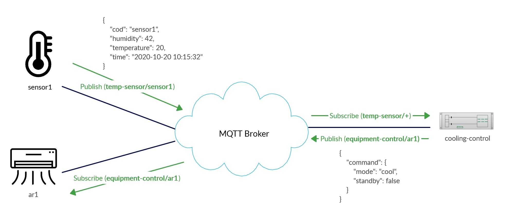

# cooling-control-mqtt-nodejs

## Dependências
- MQTT: The Standard for IoT Messaging (https://mqtt.org/)
- Node.js (https://nodejs.org/en/)
- MQTT.js (https://github.com/mqttjs/MQTT.js)

## Arquitetura da Aplicação


## Como usar
1. Instale as dependências usando o gerenciador NPM.
```sh
npm install
```
> Dica: caso queira, poderá utilizar o gerenciador *Yarn*.

2. Inicie o Broker MQTT ou utilize um serviço de broker de terceiros.
> Dica: utilize MQTT Server *Eclipse Mosquitto*.  
Site: https://mosquitto.org/  
Documentação: https://mosquitto.org/documentation/
```sh
mosquitto -v
```

3. Altere as configurações de server no arquivo *_'config.js'_* localizado na pasta *'src/config/'*.
```javascript
const options = {
    port: 1883,
    host: '127.0.0.1',
    protocol: 'mqtt',
    username: undefined,
    password: undefined,
    reconnectPeriod: 10000
};
```
> Altere os valores de *username* ou *password* caso o serviço de broker utilizado necessite de autenticação.

4. Os dados de sensores e equipamentos de ar-condicionado ficam armazenado no arquivo *_'sensors-equipments.json_*, localizado na pasta *'src/config/'*.
> Caso queira, poderá inserir ou remover itens para testar a aplicação.
```json
[
    {
        "cod": "sensor1",
        "name": "Sensor 1",
        "equipment": {
            "cod": "ar1",
            "name": "Ar-Condicionado 1"
        },
        "updatetime": 5000
    }
]
```
> O modelo de dados é composto pelas informações do sensor (cod e name), equipment  (cod, name) e timeupdate (tempo utilizado para agendar a consulta periódica dos dados do sensor).

5. Para iniciar a aplicação, utilize três abas distintas do terminal e digite os seguintes comandos:
- Iniciar o *'Sensor Publishers (Temperature/Humidity)'*
```sh
npm run sensor-publish
```

- Iniciar o *'Cooling Control Subscriber/Publisher'*
```sh
npm run cooling-control
```

- Iniciar o *'Equipment Subscribers'*
```sh
npm run equipment-subscribe
```